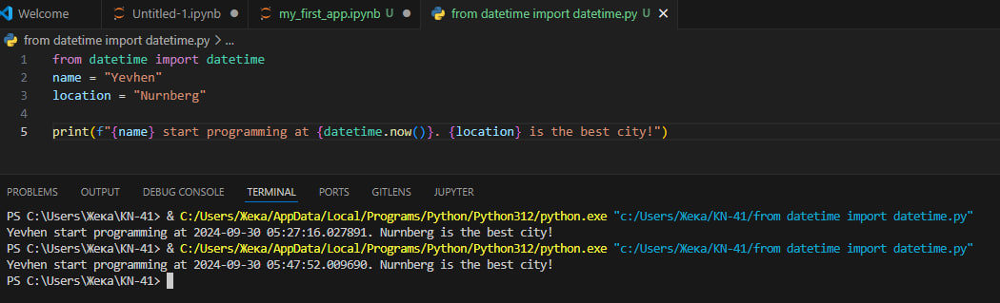
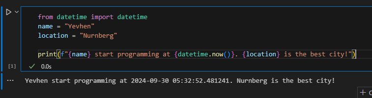
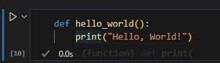

# Звіт до роботи

## Тема: _Оформлення робіт та перша програма_

### Мета роботи: _Навчитися створювати та запускати прості програми на Python у середовищі Visual Studio Code та Jupyter Notebook, використовувати форматування Markdown._

---

### Виконання роботи

1. **Створиb папку для роботи**: 
    - У кореневій папці репозиторію створено нову папку `lab1`.
    - Скопіюваb шаблон `README.md` до цієї папки.

2. **Встановиb необхідні плагіни у VSCode**:
    - Інстальовано плагін `Python`, а також додаткові плагіни, такі як `Jupyter`.

3. **Створиb перший Python файл**: 
    - Створено файл `my_first_app.py` з таким кодом:
    ```python
    from datetime import datetime
    name = "Yevhen"
    location = "Nurnberg"

    print(f"{name} start programming at {datetime.now()}. {location} is the best city!")
    ```
    - Програма вивела:
      ```text
      Yevhen start programming at 2024-09-30 05:27:16.027891. Nurnberg is the best city!
      ```
    - Додаb скріншот виконання програми.
      

4. **Створиb Jupyter Notebook файл**:
    - Створено файл `my_first_app.ipynb`.
    - Додаb код програми у першу комірку та виконали її.
    - Створиb нову комірку з типом `Markdown`, де описали код, використовуючи заголовок:
    ```markdown
    # Моя перша програма на Python
    ```
    - Додаb скріншот виконання Notebook.
      

5. **Інтерактивне використання AI**:
    - Запитаb ChatGPT, яку першу програму він би написав. Відповідь:
    ```python
    def hello_world():
        print("Hello, World!")
    ```
    - Додаb код до Jupyter Notebook.

      

---

### Висновок

- **Що зроблено в роботі**: Створено першу програму на Python у файлах `.py` та `.ipynb`, протестовано форматування Markdown, інтегровано зображення та код у звіт.
- **Чи досягнуто мети роботи**: Так, мета роботи досягнута — навчиbся створювати та запускати прості програми.
- **Які нові знання отримано**: Робота з Python, Jupyter Notebook, та Markdown.
- **Чи вдалось відповісти на всі питання задані в ході роботи**: Так.
- **Чи вдалося виконати всі завдання**: Так, усі завдання виконано.
- **Чи виникли складності у виконанні завдання**: Ні, процес виконання був зрозумілим.
- **Чи подобається такий формат здачі роботи (Feedback)**: Так, такий формат роботи є зручним.
- **Побажання для покращення (Suggestions)**: Можна додати більше прикладів для складніших завдань.

---
