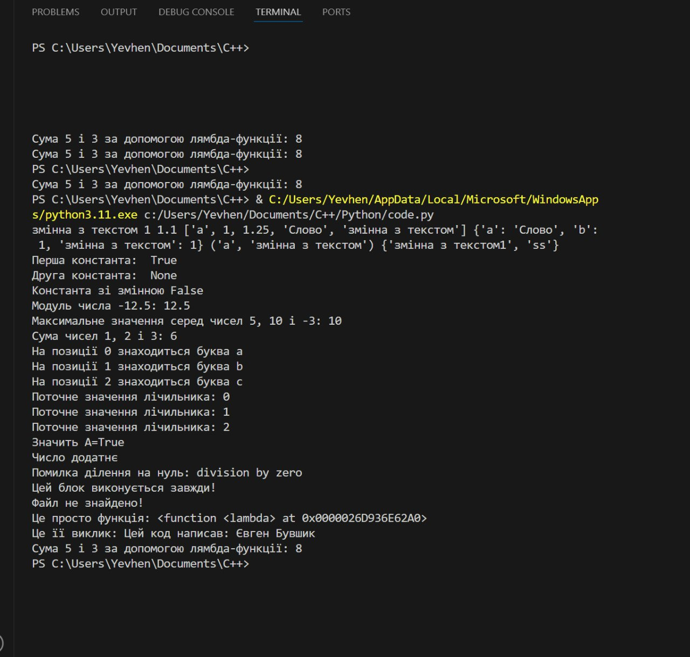

# Звіт до роботи
## Тема: Основи програмування на Python
### Мета роботи: Ознайомлення з основними конструкціями мови Python та їх застосуванням на практиці.

---

### Виконання роботи

* Результати виконання завдання:
    1. Розробили та виконали приклади з основними типами даних у Python:
        ```python
        # Просте присвоєння змінних різних типів даних
        a = "змінна з текстом"  # рядок (str)
        b = 1  # ціле число (int)
        b1 = 1.1  # число з плаваючою крапкою (float)
        c = ["a", 1, 1.25, "Слово", a]  # список (list)
        d = {"a": "Слово", "b": 1, a: b}  # словник (dict)
        e = ("a", a)  # кортеж (tuple)
        f = {"ss", a + str(b)}  # множина (set)
        
        print(a, b, b1, c, d, e, f)
        ```

    2. Вивели вбудовані константи:
        ```python
        print("Перша константа: ", True)
        print("Друга константа: ", None)
        print(f"Константа зі змінною {False}")
        ```

    3. Використали вбудовані функції:
        ```python
        print("Модуль числа -12.5:", abs(-12.5))
        print("Максимальне значення серед чисел 5, 10 і -3:", max(5, 10, -3))
        print("Сума чисел 1, 2 і 3:", sum([1, 2, 3]))
        ```

    4. Ознайомилися з циклами:
        ```python
        # Приклад з циклом for
        letters = ["a", "b", "c"]
        for i in range(len(letters)):
            print(f"На позиції {i} знаходиться буква {letters[i]}")

        # Приклад з циклом while
        count = 0
        while count < 3:
            print(f"Поточне значення лічильника: {count}")
            count += 1
        ```

    5. Демонстрація роботи розгалужень:
        ```python
        A = True
        print("Значить A=True" if A else "Значить A=False")

        number = 5
        if number > 0:
            print("Число додатнє")
        elif number < 0:
            print("Число від’ємне")
        else:
            print("Число дорівнює нулю")
        ```

    6. Конструкція try -> except -> finally:
        ```python
        A = 0
        try:
            print("Що буде якщо", 10 / A, "?")
        except ZeroDivisionError as e:
            print("Помилка ділення на нуль:", e)
        finally:
            print("Цей блок виконується завжди!")
        ```

    7. Використання контекст-менеджера with:
        ```python
        try:
            with open("README.md", "r") as f:
                for line in f:
                    print(line.strip())
        except FileNotFoundError:
            print("Файл не знайдено!")
        ```

    8. Демонстрація лямбда-функцій:
        ```python
        # Приклад використання лямбда-функції
        this_is_lambda = lambda first, last: f'Цей код написав: {first} {last}'
        print("Це просто функція:", this_is_lambda)
        print("Це її виклик:", this_is_lambda('Богдан', 'Бугиль'))

        # Інший приклад лямбда-функції для додавання двох чисел
        add = lambda x, y: x + y
        print("Сума 5 і 3 за допомогою лямбда-функції:", add(5, 3))
        ```

* Вставлені рисунки:
    > 

* Результати виконання індивідуального завдання:
    - Окремий файл з програмою завантажено до репозиторію.
    [Посилання на файл `code.py`](./code.py)
)

---

### Висновок:
> У висновку відповідаю на питання:

- :question: Що зроблено в роботі;
    - Виконано базові завдання з освоєння основних конструкцій Python.
- :question: Чи досягнуто мети роботи;
    - Так, ознайомлено з основами Python.
- :question: Які нові знання отримано;
    - Розглянуто типи даних, цикли, розгалуження, try-except, контекст-менеджери та лямбда-функції.
- :question: Чи вдалося відповісти на всі питання, задані в ході роботи;
    - Так, всі питання та завдання були зрозумілими і вирішеними.
- :question: Чи вдалося виконати всі завдання;
    - Так, виконано всі завдання згідно з інструкцією.
- :question: Чи виникли складності у виконанні завдання;
    - Складностей не виникло, завдання були чітко сформульовані.
- :question: Чи подобається такий формат здачі роботи (Feedback);
    - Так, формат зручний для структурованої роботи та наочності.
- :question: Побажання для покращення (Suggestions);
    - Додати більше завдань на практичне застосування вбудованих функцій та лямбда-функцій для глибшого розуміння.

---
